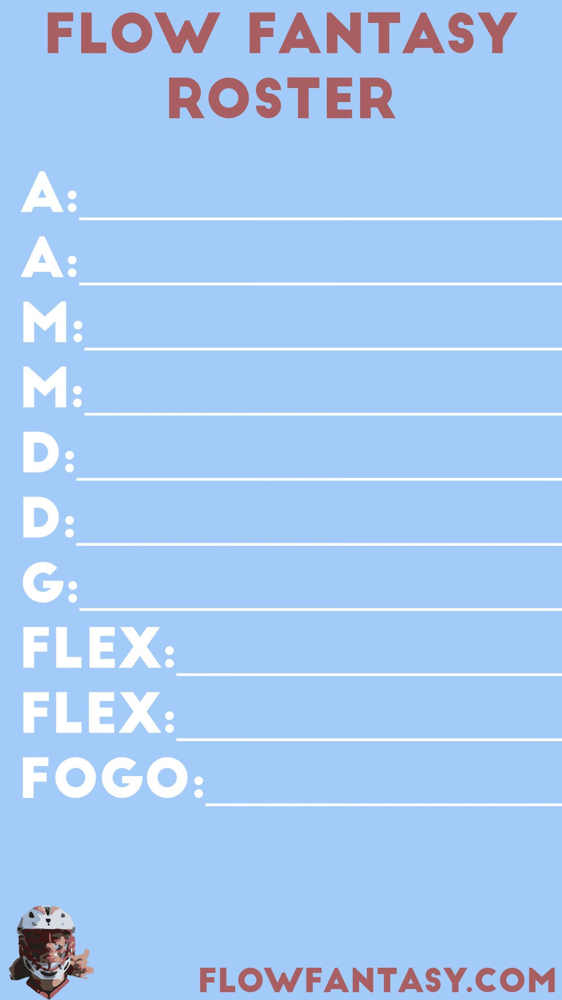
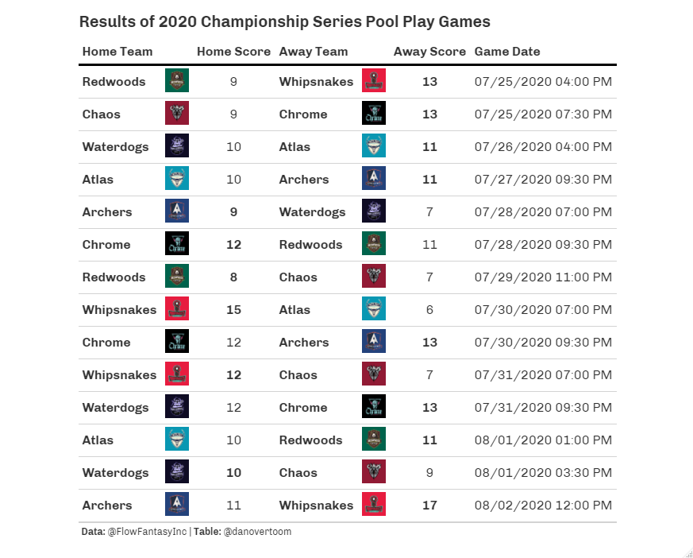
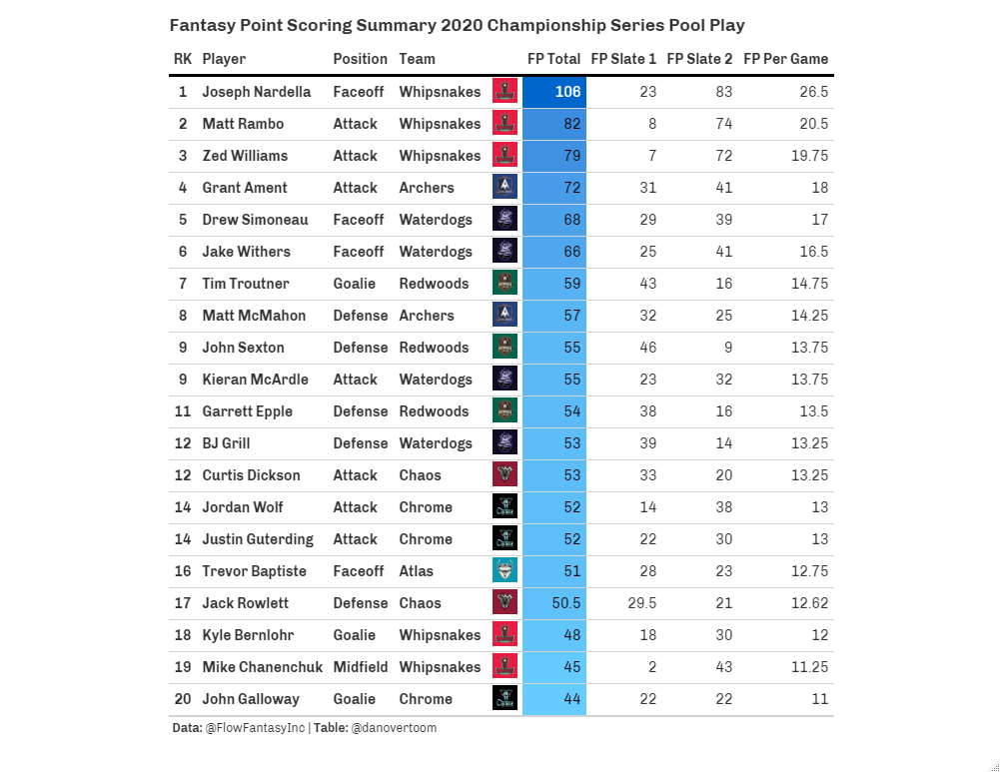

```{r setup, include=FALSE}
knitr::opts_chunk$set(echo = FALSE)
```

The summer of 2020 was full of many unexpected things. One of the most enjoyable by far was the inaugural season of Fantasy Lacrosse. The Premier Lacrosse League (PLL) was coming off of it's inaugural 2019 season that featured games in 14 different cities across the U.S. and Canada. Like many other sports leagues, the COVID-19 pandemic forced a change of plans for the 2020 season. 

The PLL opted to play a self contained or bubble season dubbed the 2020 PLL Championship Series in Herriman, Utah. This condensed season featured 14 Group Play Games, where each of the seven teams played 4 games, followed by a single elimination playoff tournament. The players of the PLL were given an opportunity to compete and the fans were given something to look forward to. The result was two great weeks of high quality lacrosse for the world to see. The 2020 Championship Series also provided a window for a first in the lacrosse world: Fantasy Lacrosse. 

Together we are going to review the 2020 Fantasy Lacrosse by giving a broad overview of what happened and then dive into the details team by team and position by position.The journey through the 2020 Fantasy Lacrosse season will provide those who participated a chance to reflect on what strategies worked or didn't and all the fun you had along the way. For those who didn't participate in Fantasy Lacrosse in 2020, I hope this series of posts inspires you to form or join a league in 2021 and hit the ground running with a strong base of knowledge.

## Flow Fantasy

With the majority of the world confined in their homes with an itch for something to do, there was a massive opportunity to make a splash in the summer of 2020. [**Flow Fantasy**](https://twitter.com/FlowFantasyInc) co-founders Grant Schwartz and Spencer Meyers seized it. Together they brought fantasy lacrosse to the fans by creating the first platform to allow the creation of individual leagues, drafts, trades, free agency and pool contests to win prizes. Flow Fantasy partnered with Pro Lacrosse Talk (now under the [Lacrosse Playground](https://www.lacrosseplayground.com) umbrella) and they put together some great articles and companion podcast to introduce and provide detail on the platform that I encourage you to [check out](https://www.lacrosseplayground.com/fantasy-lacrosse/).

Flow Fantasy brought joy to countless fans (including myself) who love both lacrosse and fantasy sports. Being able to put together a league of your buddies and get together for a draft (albeit via Zoom) complete with hot takes and trash talk is an experience that lacrosse fans have been waiting for. I thoroughly enjoyed previewing the season with some pals while drafting our favorite players to compete and see who put together the ultimate fantasy lacrosse team. None of the members of our league, which consisted of both avid and casual lacrosse fans, knew quite what we were getting ourselves into but at the end of the 2020 PLL Championship Series everyone was happy to have played and gained a new appreciation for the game, players and statistics behind it all. 

## Roster Components

Flow Fantasy provided a choice of two league formats in 2020, with the intention to accommodate leagues of various sizes. One league format option allowed users to create a starting lineup consisting of two attackmen, two midfielders, two defensemen and one alternate player (either a Faceoff Man or Goalie). The second league format allowed a starting lineup of ten players, requiring teams to start both a Faceoff Man and a Goalie while also featuring two FLEX spots in which an Attachman, Midfielder or Defensemen could be used. 

 

This series of blog posts will be focused on the league option that allowed a larger starting roster - because in my opinion starting more players is more fun and with the wealth of talent at every position in the PLL, why not. Considering that this format requires each team to have a Faceoff Man and Goalie on their roster, it likely means that leagues should be limited to the number of PLL teams (7 in 2020, 8 in 2021). However, with certain teams utilizing two Faceoff Men and two Goalies in 2020 it is possible to have larger leagues with this format - especially with the influx of talent entering the league in 2021. Regardless, being aware of what roster option your league uses us an important first step in building your ultimate fantasy lacrosse team. In the position by position blog post to follow, we will be diving deeper into the best strategies for roster construction.

## Scoring

Let's take a step back and quickly go over some fantasy basics. Similar to other fantasy sports, Fantasy Lacrosse involves selecting players from a pool through a snake draft. Then each team sets a lineup according to the roster requirements each week or slate of games. The goal is to set an optimal lineup that will earn your team the most points possible. Players score fantasy points for achieving statistically measurable actions in their games. The scoring system for Fantasy Lacrosse through Flow Fantasy is as follows (images taken from [`@FlowFantasyInc`](https://twitter.com/FlowFantasyInc)):

```{r}
#read in the 2 flow fantasy scoring graphics 
scoring1 <- magick::image_read("figures/flow_fantasy_scoring1.jpg")
scoring2 <- magick::image_read("figures/flow_fantasy_scoring2.png")
#arrange them side by side
magick::image_append(c(scoring1, scoring2))
```

In the Fantasy Lacrosse 2020 in Review blog series we will dive into the details of PLL Championship Series to see which teams, position groups and players had the largest impact on the 2020 Fantasy Lacrosse season. Although this is a small sample of games, I believe there are still valuable insights we can gather from the 2020 season in preparation to become a dominant force in the 2021 Fantasy Lacrosse season and beyond.

## 2020 PLL Championship Series

The PLL made the best of difficult situation by opting to play a 20 game bubble season in the summer of 2020 called the *PLL Championship Series*. Thankfully due to the hard work of their staff and players, no positive COVID-19 were recorded as a result of the Series. The flexibility and determination of the PLL allowed fans to enjoy the first season of Fantasy Lacrosse. 

The 14 games of Pool Play in which each of the seven teams played four games over two weeks, served as the "regular season" for the inaugural fantasy lacrosse season. The results of these games are summarized below:



Due to the schedule of the Pool Play games, Flow Fantasy elected to split the fantasy season into two slates. The first slate consisted of the first 7 games played from July 25th to July 29th, with the second slate consisting of the following 7 games played from July 30th to August 2nd. This division of games was as close to even as possible with most teams playing two games in each slate. However, the Redwoods LC played 3 games in the first slate and the Whipsnakes played 3 games in the second slate of games. Fantasy players set separate lineups for each of these slates and we can see from the perfect lineups from each slate how advantageous it was to avoid using players from the Whipsnakes in Slate 1 and the Redwoods in Slate 2.

```{r}
#read in perfect lineup tables for each slate
slate1 <- magick::image_read("figures/first_slate_perfect_lineup.png")
slate2 <- magick::image_read("figures/second_slate_perfect_lineup.png")

#arrange them side by side
magick::image_append(c(slate1, slate2))
```

The cumulative total of fantasy points for each slate determined the winner of each fantasy league. League winners were likely cognizant of the matchups each of their players faced in each slate of games and set their lineups in a manner that optimized for the most projected fantasy points taking into account strength of opponent and number of games played per slate. A quick look at the Top 20 Fantasy Scorers of the Championship Series shows which players shined in the shortened season.



In the blog posts to follow in the 2020 Fantasy Lacrosse in review we will dive deeper into the top performers from a statistical perspective.

## Statistical Overview

