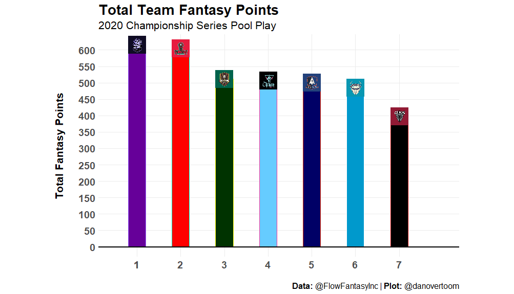
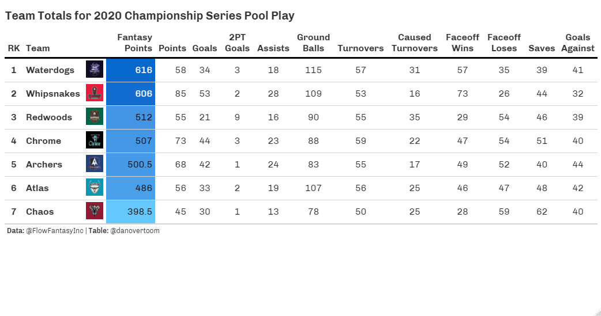

```{r setup, include=FALSE}
knitr::opts_chunk$set(echo = FALSE)
```

Welcome back to 2020 Fantasy Lacrosse in Review. In this post we will take an in depth look into each PLL Club's performance in the 2020 PLL Championship series from a fantasy lacrosse perspective. If you missed the Introduction to the 2020 Fantasy Lacrosse in Review and fantasy lacrosse in general, you can get caught up [here](https://danalytics.blog/posts/2021-02-21-introducing-fantasy-lacrosse-2020-in-review/). Recall that the 2020 Fantasy Season provides us with a small sample size of 4 games, so all of the analysis here should be taken as piece of the puzzle but not the full picture. I believe it is important to analyze all the historical data available no matter how small the sample is as long as we keep the context in mind. These four games played in the summer of 2020 were played under extraordinary circumstances and do not define the careers of any player or any team. This is especially important to keep in mind when analyzing a league like the PLL, that is constantly changing and growing year to year with a large amount of player movement through expansion, trades and free agency.  Please note all statistical data for this post has been provided in courtesy by [Flow Fantasy](https://twitter.com/FlowFantasyInc) and their stats API. 

We begin our Club by Club fantasy breakdown by looking at league wide trends to get a sense of the overall picture for the 2020 season. 

Looking at the distribution of Total Fantasy Points scored for each PLL Club we see that the Redwoods, Chrome, Archers and Atlas LC's were relatively even. While the Waterdogs and Whipsnakes LC's scored slightly more and the Chaos LC was a bit less than the middle cluster. 

A closer look at the statistical categories breakdowns for each 

## Waterdogs

## Whipsnakes

## Redwoods

## Chrome

## Archers

## Atlas

## Chaos

