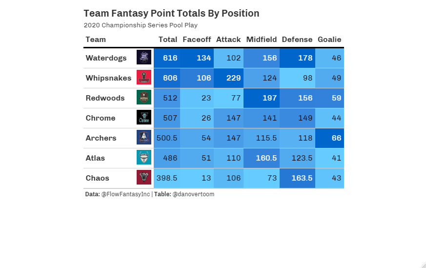
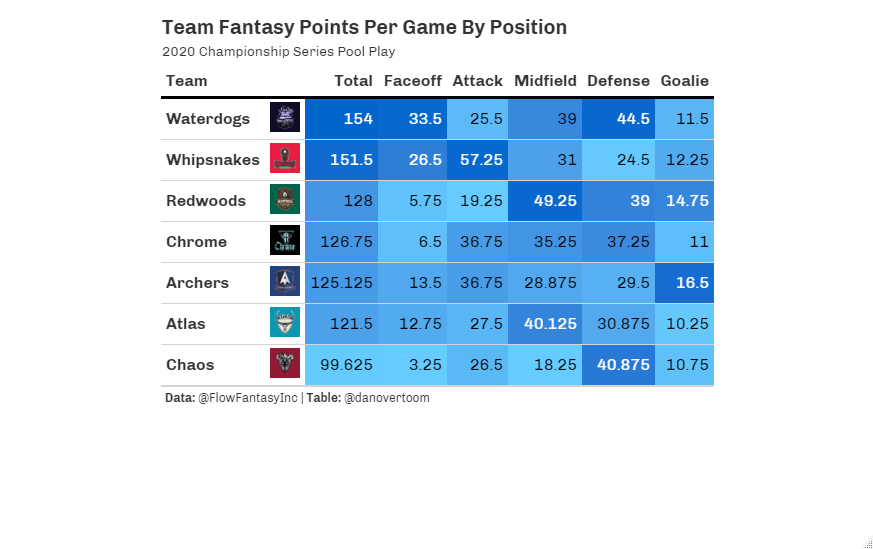
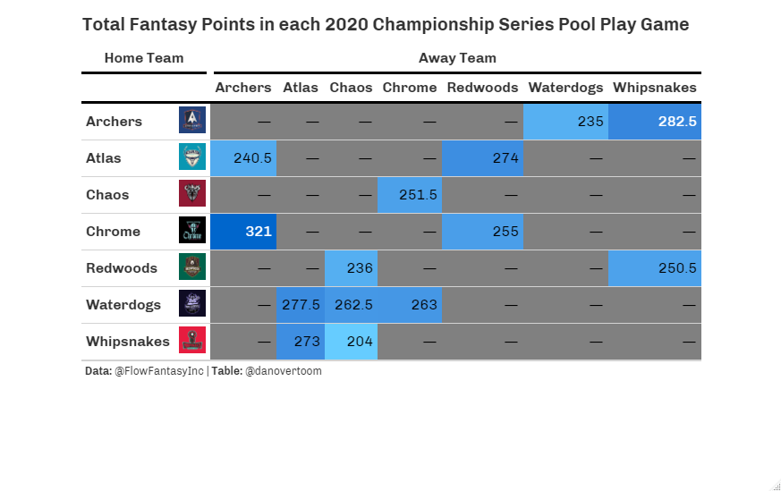

```{r setup, include=FALSE}
knitr::opts_chunk$set(echo = FALSE)
```

Welcome back to 2020 Fantasy Lacrosse in Review. In this post we will take an in depth look into each PLL Club's performance in the 2020 PLL Championship series from a fantasy lacrosse perspective. If you missed the Introduction to the 2020 Fantasy Lacrosse in Review and fantasy lacrosse in general, you can get caught up [here](https://danalytics.blog/posts/2021-02-21-introducing-fantasy-lacrosse-2020-in-review/). 

Recall that the 2020 Fantasy Season provides us with a small sample size of 4 games, so all of the analysis here should be taken as piece of the puzzle but not the full picture. I believe it is important to analyze all the historical data available no matter how small the sample is as long as we keep the context in mind. These four games played in the summer of 2020 were played under extraordinary circumstances and do not define the careers of any player or any team. This is especially important to keep in mind when analyzing a league like the PLL, that is constantly changing and growing year to year with a large amount of player movement through expansion, trades and free agency.  Please note all statistical data for this post has been provided in courtesy by [Flow Fantasy](https://twitter.com/FlowFantasyInc) and their stats API. 

Before we dive into the details take a quick refresher of the scoring system for the 2020 Flow Fantasy Season:

```{r}
#read in the 2 flow fantasy scoring graphics 
scoring1 <- magick::image_read("figures/flow_fantasy_scoring1.jpg")
scoring2 <- magick::image_read("figures/flow_fantasy_scoring2.png")
#arrange them side by side
magick::image_append(c(scoring1, scoring2))
```

We begin our Club by Club fantasy breakdown by looking at league wide trends to get a sense of the overall picture for the 2020 season. 

Looking at the distribution of Total Fantasy Points scored for each PLL Club we see that the Redwoods, Chrome, Archers and Atlas LC's were relatively even. While the Waterdogs and Whipsnakes LC's scored a bit more and the Chaos LC scored a bit less Fantasy Points than the middle cluster. 

A closer look at the breakdowns for each statistical scoring category below shows each Club's strengths and weaknesses.


We see that the Waterdogs and Whipsnakes scored about 100 more fantasy points than the middle cluster of Club, but took different paths to the top of the scoring chart. The Waterdogs LC thrived on a league leading 115 groundballs, second highest caused turnover total and a strong duo of successful faceoff men. While the WHipsnakes LC shined through their potent offense with league highs in goals and assists with solid performances in all other areas. Turning to the bottom of the chart we see how league lows in goals, assists, and groundballs paired with below average faceoff play hurt the Chaos LC's fantasy point output. 

The fantasy point scoring breakdown by position group below shows which areas of the field Clubs excelled in or had trouble producing in. 

```{r panelset, echo=FALSE}
xaringanExtra::use_panelset()
```

::::: {.panelset}

::: {.panel}

## Totals {.panel-name}



:::

::: {.panel}

## Per Game {.panel-name}

{strip.white=TRUE}

:::

:::::
```{r}
library(tidyverse)
#league averages
#load full 2020 Championship Series Pool Play games file
full_2020_games <- read.csv("_data/full_2020_games.csv", header = TRUE, stringsAsFactors = FALSE)
#team totals for 2020 season
summary_2020_tm_pos <- full_2020_games %>% 
     group_by(Team, Position) %>% 
     summarise(TotalFantasyPoints = sum(score)
               ) %>% 
     ungroup()
#total fantasy points by position
fp_pos_tot <- summary_2020_tm_pos %>% 
        select(Team, Position, TotalFantasyPoints) %>% 
        pivot_wider(names_from = Position, values_from = TotalFantasyPoints) %>% 
        mutate(Total = Attack + Midfield + Goalie + Defense + Faceoff) %>%
        select(Team, Total, Faceoff, Attack, Midfield, Defense, Goalie) %>% 
        arrange(desc(Total))
#create table of league averages for all stat categories
pos_lg_avg_2020 <- fp_pos_tot %>% 
        summarise(Total = mean(Total),
        Faceoff = round(mean(Faceoff), 2),
        Attack = round(mean(Attack), 2),
        Midfield = round(mean(Midfield), 2),
        Defense = round(mean(Defense), 2), 
        Goalie = round(mean(Goalie), 2)
        ) %>% 
        mutate(Team = "League Average") %>% 
        select(Team, everything())
```
A few observations that stick out: the top two Clubs had Faceoff production well above the league average of `r pos_lg_avg_2020$Faceoff`. The Whipsnakes Attack unit scored `r filter(fp_pos_tot, Team == "Whipsnakes")$Attack - filter(fp_pos_tot, Team == "Chrome")$Attack` more fantasy points than the next highest unit. The Chrome LC had almost equal fantasy production from their Attack, Midfield and Defensive units.The per game fantasy points by position group shows which units were reliable from game like the Redwoods' Midfielders, Archer's Goalies, Whipsnakes' Attackmen, and Waterdogs Faceoff-men and Defenders. While the Atlas' Goalies, Redwoods' Attackmen, Chaos' Faceoff-men and Midfielders could not be relied on for consistent fantasy production game in and game out.

In fantasy sports, we are tasked with identifying matchups that will produce the most fantasy points for the players on our rosters. To maximize our fantasy potential it is important to target players with the highest expected opportunity for statistical success. One strategy is to identify matchups that have high fantasy point totals. This could be the result of a high scoring back and forth type game, a top offense taking advantage of a weaker defense, a blowout followed by some "garbage time" scoring or individual battles that have a history of being dominated by one side. Below we can see the fantasy point totals for each game of the 2020 Fantasy Season.

We see that two of the highest scoring games, Whipsnakes-Archers and Archers-Chrome produced two of the highest fantasy point totals. Then the lowest fantasy point total games coming from the lowest scoring game, Redwoods-Chaos and one of the most lopsided games, Chaos-Whipsnakes. 

In the sections below we will take a deeper look at each Club's 2020 Fantasy performance. We examine each Club's style, most and least beneficial matchups, how they stacked up against the league average and positional breakdowns. 

```{r}
#make table to be used for club pie charts and club vs league avg tables
#pie charts table
fp_club_pie <- summary_2020_tm_pos %>% 
  rename(Club = Team)
#club vs lg avg table
fp_club_lg_avg <- rbind(fp_pos_tot, pos_lg_avg_2020) %>% 
  rename(Club = Team)
#bring in function to create club pie charts
source("functions/club_pie.R")
#bring in function to create club vs lg avg tbls
source("functions/club_lg_avg_tbl.R")

#gathering data for positional player tables
summary_2020_plyr <- full_2020_games %>% 
     mutate(Player = paste(FirstName, LastName)) %>% 
     group_by(Player, Position, Team) %>% 
     summarise(TotalFantasyPoints = sum(score),
               FantasyPointsPG = mean(score),
               TotalPoints = sum(Goals) + (2*sum(X2PtGoals)) + sum(Assists),
               TotalGoals = sum(Goals),
               Total2ptGoals = sum(X2PtGoals),
               TotalAssists = sum(Assists),
               TotalGroundBalls = sum(GroundBalls),
               TotalTurnovers = sum(Turnovers),
               TotalCausedTurnovers = sum(CausedTurnovers),
               TotalFaceoffWins = sum(FaceoffWins),
               TotalFaceoffLosses = sum(FaceoffLosses),
               AverageFaceoffWinPercentage = mean(FaceoffPercentage),
               TotalGoalsAgainst = sum(GoalsAgainst),
               TotalSaves = sum(Saves),
               AverageSavePercentage = mean(SavePercentage)
               ) %>% 
     ungroup() %>% 
     rename(Club = Team)
#bring in function to create offensive player table for each club
source("functions/offense_plyr_tbl.R")
#bring in function to create defensive player table for each club
source("functions/defense_plyr_tbl.R")
#bring in function to create specialist player table for each club
source("functions/specialist_plyr_tbl.R")
```


# Waterdogs LC

::::: {.panelset}

::: {.panel}

## Positional Pie {.panel-name}

```{r}
club_pie("Waterdogs")
```

:::

::: {.panel}

## Positional Vs League Avg {.panel-name}

```{r}
club_lg_avg_tbl("Waterdogs")
```

:::

:::::

The Waterdogs 2020 Fantasy Season was surprising in many ways.

<details>
  <summary>Offense</summary>
```{r}
offense_plyr_tbl("Waterdogs", 5, 7)
```

The Waterdogs offense

</details>

<details>
  <summary>Defense</summary>
```{r}
defense_plyr_tbl("Waterdogs", 6)
```

The Waterdogs defense


</details>

<details>
  <summary>Specialists</summary>
```{r}
specialist_plyr_tbl("Waterdogs", 2, 2)
```

The Waterdogs specialists

</details>

# Whipsnakes LC

::::: {.panelset}

::: {.panel}

## Positional Pie {.panel-name}

```{r}
club_pie("Whipsnakes")
```

:::

::: {.panel}

## Positional Vs League Avg {.panel-name}

```{r}
club_lg_avg_tbl("Whipsnakes")
```

:::

:::::

The Whipsnakes 2020 Fantasy Season was exactly what you woukd expect to see. Dominance.

<details>
  <summary>Offense</summary>
```{r}
offense_plyr_tbl("Whipsnakes", 4, 11)
```

The Whipsnakes offense

</details>

<details>
  <summary>Defense</summary>
```{r}
defense_plyr_tbl("Whipsnakes", 5)
```

The Whipsnakes defense

</details>

<details>
  <summary>Specialists</summary>
```{r}
specialist_plyr_tbl("Whipsnakes", 1, 1)
```

The Whipsnakes specialists

</details>

# Redwoods LC

::::: {.panelset}

::: {.panel}

## Positional Pie {.panel-name}

```{r}
club_pie("Redwoods")
```

:::

::: {.panel}

## Positional Vs League Avg {.panel-name}

```{r}
club_lg_avg_tbl("Redwoods")
```

:::

:::::

The Redwoods 2020 Fantasy Season - pretty average.

<details>
  <summary>Offense</summary>
```{r}
offense_plyr_tbl("Redwoods", 4,10)
```

The Redwoods offense

</details>

<details>
  <summary>Defense</summary>
```{r}
defense_plyr_tbl("Redwoods", 5)
```

The Redwoods defense

</details>

<details>
  <summary>Specialists</summary>
```{r}
specialist_plyr_tbl("Redwoods", 2, 1)
```

The Redwoods specialists
  
</details>

# Chrome LC

::::: {.panelset}

::: {.panel}

## Positional Pie {.panel-name}

```{r}
club_pie("Chrome")
```

:::

::: {.panel}

## Positional Vs League Avg {.panel-name}

```{r}
club_lg_avg_tbl("Chrome")
```

:::

:::::

The Chrome's 2020 Fantasy Season was as expected - offensively driven with solid performances from the other position groups.

<details>
  <summary>Offense</summary>
```{r}
offense_plyr_tbl("Chrome", 5, 5)
```

The Chrome offense

</details>

<details>
  <summary>Defense</summary>
```{r}
defense_plyr_tbl("Chrome", 7)
```

The Chrome defense

</details>

<details>
  <summary>Specialists</summary>
```{r}
specialist_plyr_tbl("Chrome", 1, 1)
```

The Chrome specialists  
  
</details>

# Archers LC

::::: {.panelset}

::: {.panel}

## Positional Pie {.panel-name}

```{r}
club_pie("Archers")
```

:::

::: {.panel}

## Positional Vs League Avg {.panel-name}

```{r}
club_lg_avg_tbl("Archers")
```

:::

:::::

The Archers' 2020 Fantasy Season

<details>
  <summary>Offense</summary>
```{r}
offense_plyr_tbl("Archers", 4, 7)
```

The Archers' offense

</details>

<details>
  <summary>Defense</summary>
```{r}
defense_plyr_tbl("Archers", 5)
```

The Archers' defense

</details>

<details>
  <summary>Specialists</summary>
```{r}
specialist_plyr_tbl("Archers", 2, 2)
```

The Archers' specialists
  
</details>

# Atlas LC


::::: {.panelset}

::: {.panel}

## Positional Pie {.panel-name}

```{r}
club_pie("Atlas")
```

:::

::: {.panel}

## Positional Vs League Avg {.panel-name}

```{r}
club_lg_avg_tbl("Atlas")
```

:::

:::::

The Atlas' 2020 Fantasy Season was similar to the Club's real-life performance - underwhelming.

<details>
  <summary>Offense</summary>
```{r}
offense_plyr_tbl("Atlas", 4, 8)
```

The Atlas' offense

</details>

<details>
  <summary>Defense</summary>
```{r}
defense_plyr_tbl("Atlas", 6)
```

The Atlas' defense

</details>

<details>
  <summary>Specialists</summary>
```{r}
specialist_plyr_tbl("Atlas", 1, 1)
```
 
The Atlas' specialists
  
</details>

# Chaos LC


::::: {.panelset}

::: {.panel}

## Positional Pie {.panel-name}

```{r}
club_pie("Chaos")
```

:::

::: {.panel}

## Positional Vs League Avg {.panel-name}

```{r}
club_lg_avg_tbl("Chaos")
```

:::

:::::

The Chaos' 2020 Fantasy Season mirrored their real-life group play performance - a struggle.

<details>
  <summary>Offense</summary>
```{r}
offense_plyr_tbl("Chaos", 5, 7)
```

The Chaos' offense

</details>

<details>
  <summary>Defense</summary>
```{r}
defense_plyr_tbl("Chaos", 7)
```

The Chaos' defense

</details>

<details>
  <summary>Specialists</summary>
```{r}
specialist_plyr_tbl("Chaos", 1, 1)
```

The Chaos' specialists
  
</details>

